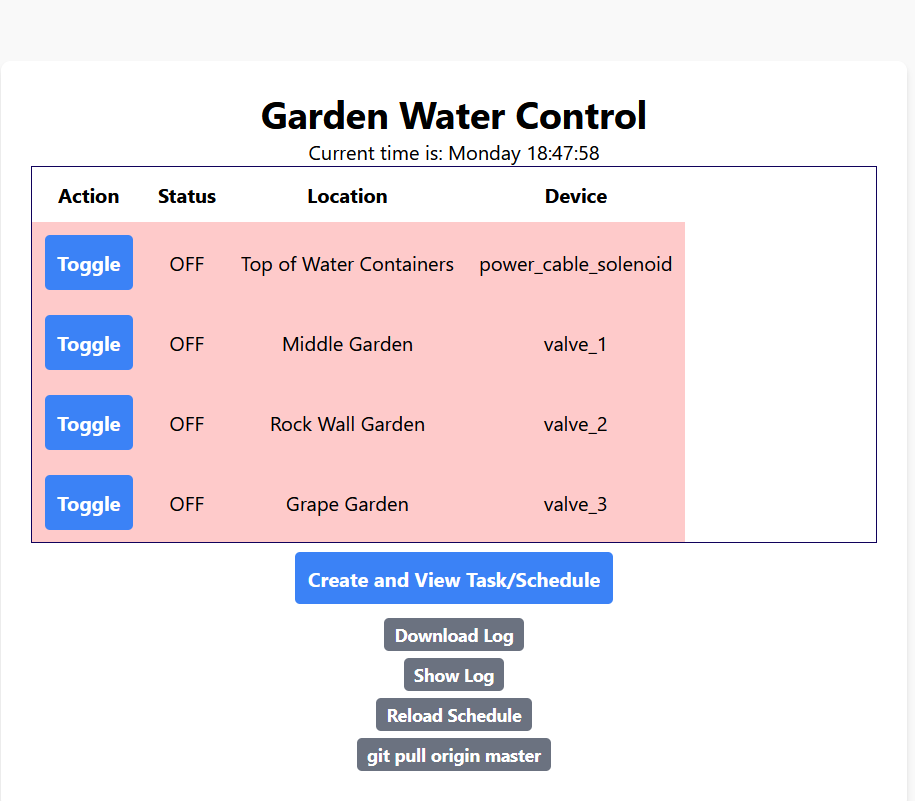
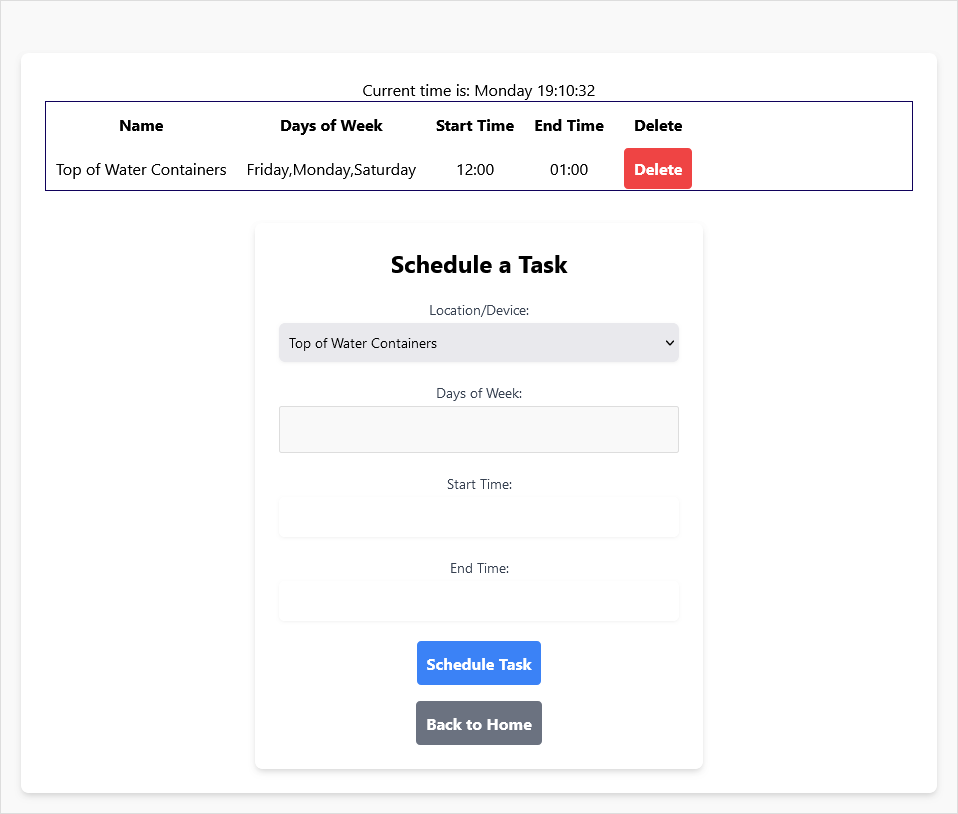

# Water project

## Overview

For my raspberry pi controlled garden watering system

I the raspberry pi hooked up to some relays that control the water flow to the garden.
The relays control the pump and valves to different parts of the garden.
I collect rain water in IPC totes and pump it to the garden.

The goal is to schedule the watering of the garden using something like `cron` and also have a web interface to control the watering system.





## Code

The code is written in python and uses the `fastapi` web framework.

using virtual envirometnt or conda

enviroment is called

`waterproject`

export depedency lsit with pip

```bash
pip freeze > requirements.txt
```

create conda env with

```bash
# conda create --name waterproject --file requirements.txt
 conda create --name waterproject  python=3.11
 pip install -r requirements.txt
```

## Device configuration

You can modify your PINS, location, and name by changing the `devices.json` file. Mine looks like.

```json

[
    {
      "name": "power_cable_solenoid",
      "pin": 12,
      "location": "Top of Water Containers"
    },
    {
      "name": "valve_1",
      "pin": 25,
      "location": "Middle Garden"
    },
    {
      "name": "valve_2",
      "pin": 23,
      "location": "Rock Wall Garden"
    },
    {
      "name": "valve_3",
      "pin": 18,
      "location": "Grape Garden"
    }
  ]
  
```

## start the server as a services

```bash
sudo nano /etc/systemd/system/uvicorn.service
```

Put something like this

```init
[Unit]
Description=Uvicorn App
After=network.target

[Service]
User=pi
WorkingDirectory=/home/pi/git/waterproject
ExecStart=/bin/bash /home/pi/git/waterproject/run_server.sh
Restart=always

[Install]
WantedBy=multi-user.target
```


Then

```bash
sudo systemctl daemon-reload
sudo systemctl enable uvicorn.service

# check status with 
sudo systemctl status uvicorn.service
sudo journalctl -u uvicorn.service | tail -n 30

```

I added a static IP on my home network to the raspberry pi so I can access the web interface from any device on my network.

